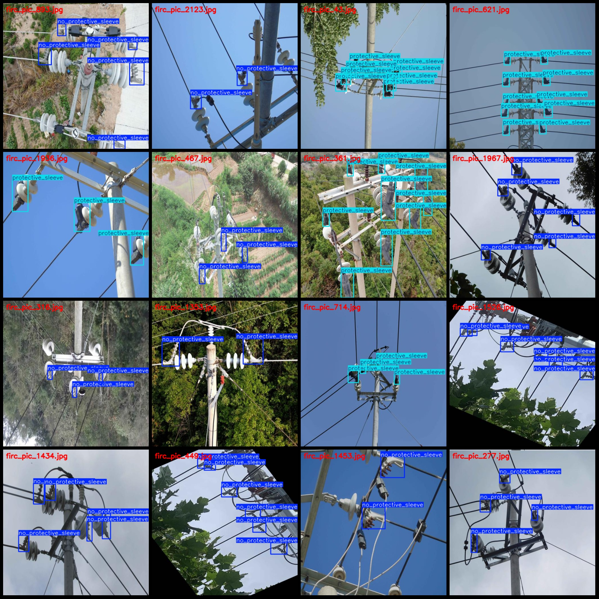
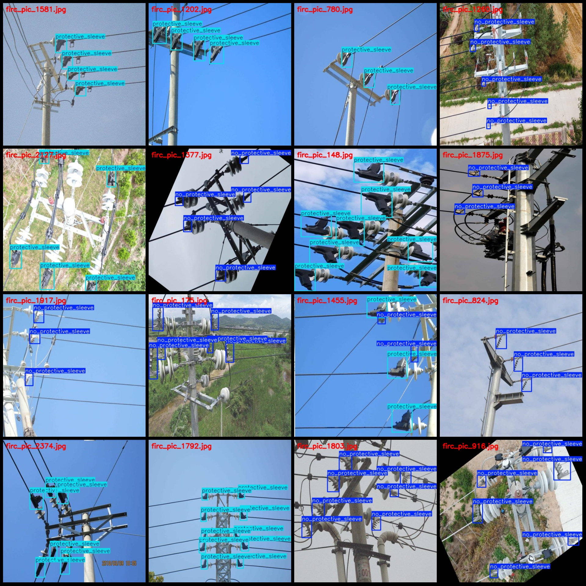

# Power Grid Cabling Insulation Protection Cover Installation Status Detection Dataset in VOC+YOLO format, 2375 images in 2 categories

Dataset format: Pascal VOC format + YOLO format (excluding split path in txt file, only containing jpg images and corresponding VOC format xml files and yolo format txt files)

Number of images (jpg files): 2375
Number of annotations (xml files): 2375
Number of annotations (txt files): 2375
Number of annotation categories: 2
Annotation categories name (notice that the order of categories in yolo format is not consistent with this, but according to the labels folder classes.txt): ["no_protective_sleeve", 
"protective_sleeve"]

Each category has a number of bounding boxes:
- no_protective_sleeve (without an insulating sleeve) = 5732
- protective_sleeve (with an insulating sleeve) = 5449
Total bounding boxes: 11181

Each category occupies a number of images:
- no_protective_sleeve (without an insulating sleeve) occupies images = 1346
- protective_sleeve (with an insulating sleeve) occupies images = 1103

Image resolution: 512x512

Annotation tools used: labelImg
Annotation rules: draw bounding boxes for categories

Important notes: The dataset does not have been split into training, validation, or test sets; you need to do so yourself.

Special notice: This dataset does not guarantee any accuracy in the trained models or weight files.

Image preview:

Annotation examples:
## Images

Here is a pay link on Stripe ( https://buy.stripe.com/3cs8yP7sY87d0vu9AB ). Please contact me lonlonago@foxmail.com after funding $89, and I will send you a complete data files , thank you!

